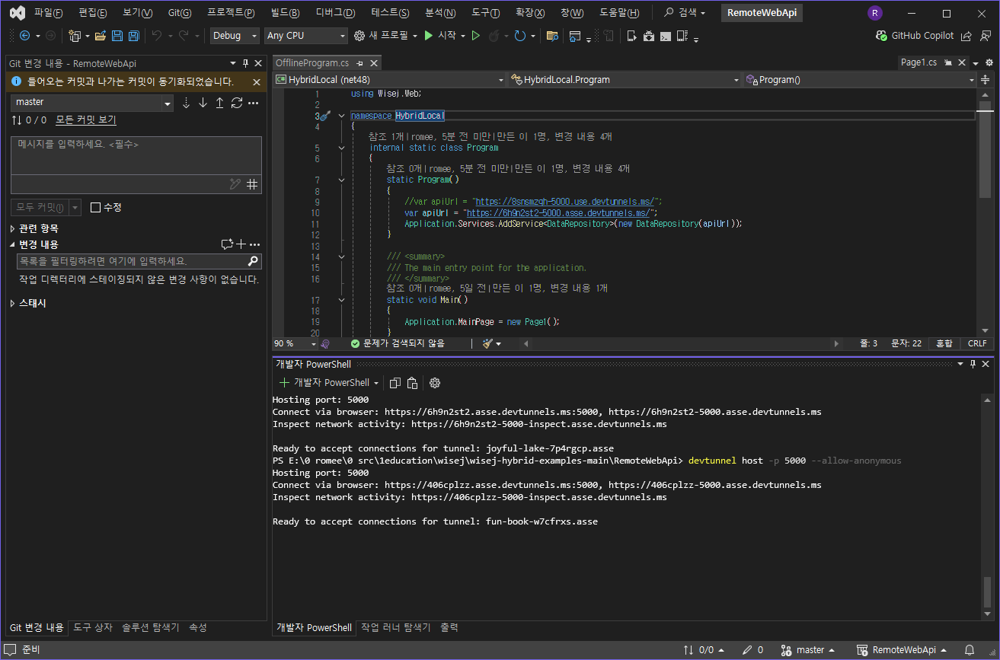

WiseJ 3.5 Hybrid를 사용하여 Windows, Android, IOS 동시에 개발하기

프로그램을 실행 하면 다음과 같은 화면을 볼 수 있습니다.

금번예제는 devtunnel 를 설치하고 안드로이드 에뮬레이터와 웹서버를 연결해야 합니다.

PS를 사용하여 아래의 명령을 수행 합니다. 

PS>> winget install Microsoft.devtunnel

devtunnel 사용

devtunnel user login -g

devtunnel host -p 5000 --allow-anonymous 

PS E:\0 romee\0 src\1education\wisej\wisej-hybrid-examples-main\RemoteWebApi> devtunnel host -p 5000 --allow-anonymous

Hosting port: 5000

Connect via browser: https://406cplzz.asse.devtunnels.ms:5000, https://406cplzz-5000.asse.devtunnels.ms

Inspect network activity: https://406cplzz-5000-inspect.asse.devtunnels.ms

Ready to accept connections for tunnel: fun-book-w7cfrxs.asse

처음 실행하면 나오는 화면 

이후 나오는 화면 

devtunnel 사용법 참조 : https://changsroad.tistory.com/575

License
-------
 Copyright (C) ICE TEA GROUP LLC, All rights reserved.

